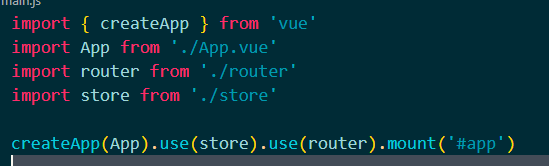
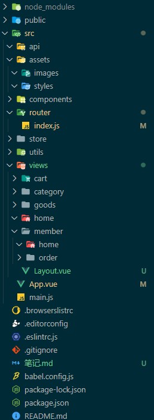
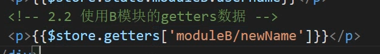
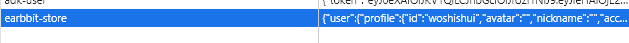
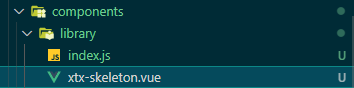

# 小兔鲜项目

笔记随记，记录一些自己不清楚的，不明白的东西。

## vue3和vue2的一些区别

在vue3中，使用router和vuex使用了createXXX的形式去使用。

而且main.js是一直使用的



```js
import { createStore } from 'vuex'

export default createStore({
  state: {
  },
  mutations: {
  },
  actions: {
  },
  modules: {
  }
})
```

## 目录结构



## jsconfig.js

用于路径提示，使用@可以有便捷的供此项目使用的路径提示

```json
//根目录下jsconfig.js
{
    "compilerOptions": {
        "baseUrl": ".",
        "paths": {
            "@/*":["./src/*"],
        }
    },
    "exclude": ["node_modules","dist"]
}
```

## .eslintignore

用于排除不语法检查的文件目录

```js
/dist
/src/vender
```


## vuex api式风格使用

```js
import {useStroe} from 'vuex'
export default {
  name:'App',
  setup() {
    const store=useStroe();
  },
}
```

## 模块式开发

在vuex中，使用多个模块，进行使用。

默认模块是不开启命名空间的，可以通过namespaced:true来进行开启。

加了namespaced，其getters mutation啥的都会放在命名空间里，如果不开，除了state之外的所有数据都会放在全局空间里。

```js
const mouduleA={
  state:{
    username:'12456'
  }
}

const mouduleB={
  namespaced:true,
  state:{
    username:'bbbbb'
  }
}
```



## vuex 持久化vuex-persistedstate

首先需要安装一个插件vuex-persistedstate

```shel
npm i vuex-persistedstate
```

import

```js
import createPersistedstate from 'vuex-persistedstate';
.............
plugins: [createPersistedstate({
    //配置存放在本地的key
    key:'earbbit-store',
    // 需要存储的 模块
    paths:['user','cart']
  })]
```



默认存储在localstorage

## 封装请求

```js
export const baseURL = 'http://pcapi-xiaotuxian-front-devtest.itheima.net'
const instance = axios.create({
  baseURL,
  timeout: 5000
})

instance.interceptors.request.use(config => {
  // 携带token

  const {
    profile
  } = store.state.user;
  if (profile.token) {
    config.headers.Authorization = `Bearer ${profile.token}`;
  }
  return config;
}, err => {
  return Promise.reject(err)
})

instance.interceptors.response.use((response) => {
  return response.data;
}, err => {
  if (err.response && err.response.status === 401) {
    // 未登录 跳转登录页 并携带当前路由地址
    // 使用$route.fullPath
    store.commit('user/setUser',{});
    // 使用encode进行转码  防止解析地址出问题
    const fullPath= encodeURIComponent(router.currentRoute.value.fullPath) ;
    router.push('/login?redirectUrl='+fullPath);
  }
  return Promise.reject(err);
})
```

## 封装工具函数

中括号选择

```js
// 工具函数
export default (url,method,submitData)=>{
    // 负责发请求
    return instance({
        url,
        method,
        // 如果是get 请求 使用params 使用其他请求 使用data
        [method.toLowerCase()==='get'?'params':'data']:submitData
    })
}
```

[]起到了未知的情况下进行选择的效果。

可以设置一个动态的key

## 混入less

混入可以让我们将重复的样式进行封装并使用。

```less
// mixins混入
.hoverShadow(){
    transition: all .5s;
    &:hover{
        transform: translate3d(0,-3px,0);
        box-shadow: 0,3px,8px,rgba(0, 0, 0, .2);
    }
}
```

### 使用样式自动注入插件

```shell
vue add style-resources-loader
```

可以看到vue.config.js中多出了一个配置项。用于配置插件

```js
const path = require('path')

module.exports = {
  lintOnSave: false,

  pluginOptions: {
    'style-resources-loader': {
      preProcessor: 'less',
      // 需要使用绝对路径
      patterns: [
        path.join(__dirname,'./src/assets/styles/mixins.less'),
        path.join(__dirname,'./src/assets/styles/variables.less'),
      ]
    }
  }
}
```

然后把mixin文件放入配置项中

重新启动后，mixins中的less样式和variable可以应用在项目中的所有less中了。

## 安装重置样式 normalize.css

在main.js中引入。

## 引入公共样式代码

```less
// 公共样式代码
// 自己的重置样式代码，公用样式代码
* {
    box-sizing: border-box;
   }
   
   html {
     height: 100%;
     font-size: 14px;
   }
   body {
     height: 100%;
     color: #333;
     min-width: 1240px;
     font: 1em/1.4 'Microsoft Yahei', 'PingFang SC', 'Avenir', 'Segoe UI', 'Hiragino Sans GB', 'STHeiti', 'Microsoft Sans Serif', 'WenQuanYi Micro Hei', sans-serif
   }
   
   ul,
   h1,
   h3,
   h4,
   p,
   dl,
   dd {
     padding: 0;
     margin: 0;
   }
   
   a {
     text-decoration: none;
     color: #333;
     outline: none;
   }
   
   i {
     font-style: normal;
   }
   
   input[type="text"],
   input[type="search"],
   input[type="password"], 
   input[type="checkbox"]{
     padding: 0;
     outline: none;
     border: none;
     -webkit-appearance: none;
     &::placeholder{
       color: #ccc;
     }
   }
   
   img {
     max-width: 100%;
     max-height: 100%;
     vertical-align: middle;
   }
   
   ul {
     list-style: none;
   }
   
   #app {
     background: #f5f5f5;
     user-select: none;
   }
   
   .container {
     width: 1240px;
     margin: 0 auto;
     position: relative;
   }
   
   .ellipsis {
     white-space: nowrap;
     text-overflow: ellipsis;
     overflow: hidden;
   }
   
   .ellipsis-2 {
     word-break: break-all;
     text-overflow: ellipsis;
     display: -webkit-box;
     -webkit-box-orient: vertical;
     -webkit-line-clamp: 2;
     overflow: hidden;
   }
   
   .fl {
     float: left;
   }
   
   .fr {
     float: right;
   }
```

## vuex使用

使用的时候务必使用计算属性来获取vuex中的属性，否则属性不是响应式的。

```js
const store=useStore();
// 使用vuex的属性需要用计算属性 否则不是响应式的
const profile=computed(()=>{
    return store.state.user.profile
})
```

## 组合式api实现吸顶导航

```shell
npm i @vueuse/core@4.9.0
```

使用core库来进行实现。

这个库中封装了很多常见的交互逻辑

** 现在已经更新到了7.4的版本。。。。

## 骨架屏加载效果



在library进行样式的调整和注册

使用全局挂载的形式去引入骨架屏的组件

```js
// 扩展vue原有的功能 全局组件，自定义指令
import XtxSkeleton from './xtx-skeleton.vue'
export default{
    install(app){
        // 在app上进行扩展 app提供
        app.component(XtxSkeleton.name,XtxSkeleton)
    }
}
```

然后再main.js里面引入，就可以全局使用了。

```js
import UI from '@/components/library';
createApp(App).use(store).use(router).use(UI).mount('#app')
```

## 组件数据懒加载

```js
useIntersectionObserver
```

用到了这个封装的函数。

```js
// stop 是停止观察是否进入或移出可视区域的行为    
const { stop } = useIntersectionObserver(
  // target 是观察的目标dom容器，必须是dom容器，而且是vue3.0方式绑定的dom对象
  target,
  // isIntersecting 是否进入可视区域，true是进入 false是移出
  // observerElement 被观察的dom
  ([{ isIntersecting }], observerElement) => {
    // 在此处可根据isIntersecting来判断，然后做业务
  },
)
```

```js
setup(props) {
    const goods = ref([]);
    // findHot().then((data) => {
    //     goods.value=data.result
    // })
    const target = ref(null);
    const result = useLazyData(target, findHot);
    return {
        goods:result,
        target
    }
}
```

hooks/index.js

```js
// 提供复用逻辑函数
import {useIntersectionObserver} from '@vueuse/core';
import {ref} from 'vue';
/**
 * 数据懒加载函数
 * @param {Element} target  dom对象
 * @param {Function} apiFn  api函数
 */
export const useLazyData = (target, apiFn) => {
    const result=ref([])
    // stop 是停止观察是否进入或移出可视区域的行为    
    const { stop } = useIntersectionObserver(
        // target 是观察的目标dom容器，必须是dom容器，而且是vue3.0方式绑定的dom对象
        target,
        // isIntersecting 是否进入可视区域，true是进入 false是移出
        // observerElement 被观察的dom
        ([{ isIntersecting }], observerElement) => {
            // 在此处可根据isIntersecting来判断，然后做业务
            if(isIntersecting){
                stop();
                apiFn().then(data=>{
                    result.value=data.result
                })
            }
        },
    )
    return result;
}
```

## 图片懒加载

IntersectionObserver

```js
// 创建观察对象实例
const observer = new IntersectionObserver(callback[, options])
// callback 被观察dom进入可视区离开可视区都会触发
// - 两个回调参数 entries , observer
// - entries 被观察的元素信息对象的数组 [{元素信息},{}]，信息中isIntersecting判断进入或离开
// - observer 就是观察实例
// options 配置参数
// - 三个配置属性 root rootMargin threshold
// - root 基于的滚动容器，默认是document
// - rootMargin 容器有没有外边距
// - threshold 交叉的比例

// 实例提供两个方法
// observe(dom) 观察哪个dom
// unobserve(dom) 停止观察那个dom
```

## 自定义指令

在library下的index.js下可以去定义一些我们自己想要自定义的指令。

```js
// 定义自定义指令的地方
const defineDirective = (app) => {
  // 图片懒加载指令
  app.directive('lazy', {
    mounted(el,binding) {
        // 定义一个图片懒加载的观察函数
        const observe = new IntersectionObserver(([{isIntersecting}]) => {
            if(isIntersecting){
                // 进入可视区域了 所以停止观察
                observe.unobserve(el);
                // 把指令的值设置给el的属性
                el.src=binding.value;
            }
        }, {
            threshold: 0
        })
        observe.observe(el)
    },
  })
}
```

### 通过自定义指令

 我们就可以用v-lazy来指定懒加载的图片了

```html
<RouterLink class="cover" :to="`/category/${item.id}`">
    
    <strong class="label">
        <span>{{item.name}}</span>
        <span>{{item.saleInfo}}</span>
    </strong>
</RouterLink>
```

同样我们可以指定图片加载失败时的默认加载图片

```js
// 图片加载失败
el.onerror=()=>{
    el.src=defaultImage
}
```

## 渲染函数

使用render函数动态去创建子节点。

```js
render(){
        // 去除template标签

        // 获取默认插槽内容
        const items=this.$slots.default();
        const dymanicItems=[];
        items.forEach((item,i)=>{
            dymanicItems.push(item);
            if(i<(items.length-1)){
                dymanicItems.push(h('i',{class:'iconfont icon-more'}))
            }   
        })
        return dymanicItems;
    }
```

## 自动批量注册组件

```js
const importFn=require.context('./',false,/\.vue$/)
```

使用context这个函数，第一个参数指定目录，第二个参数指定是否加载子目录，第三个参数指定匹配文件的正则表达式

```js
importFn.keys().forEach(path => {
        // 导入组件
        const component=importFn(path).default
        // 进行组件注册
        app.component(component.name,component);
    });
```

遍历所有path 并进行组件的注册。

这样就不需要以后每次新建一个全局组件都要进来手动注册了。

## 切换路由滚动行为

```js

const router = createRouter({
  history: createWebHashHistory(),
  routes,
  scrollBehavior(){
    return {x:0,y:0}
  }
})
```

 scrollBehavior通过这个函数，可以设置我们每次切换路由回到页面的哪个位置

## 父传子子传父

```js
setup(props,{emit}) {
      let checked = ref(false);
      const change = () => {
        checked.value = !checked.value;
        emit('update:modelValue',checked)
      }

    //   使用watch 来进行侦听
    watch(()=>props.modelValue,()=>{
        checked.value=props.modelValue;
    },{immediate:true})
      return {
        checked,
        change
      }
    }
```

### 使用useVmodel

```js
const checked=useVModel(props,'modelValue',emit);
const change=()=>{
    const newValue=!checked.value;
    checked.value=newValue;
}
```

## 排序组件

## 数据加载


## useMouseInElement

用于监听鼠标在某个元素中的距离


## sku 组件

官方话术：

- SPU（Standard Product Unit）：标准化产品单元。是商品信息聚合的最小单位，是一组可复用、易检索的标准化信息的集合，该集合描述了一个产品的特性。通俗点讲，属性值、特性相同的商品就可以称为一个SPU。
- SKU（Stock Keeping Unit）库存量单位，即库存进出计量的单位， 可以是以件、盒、托盘等为单位。SKU是物理上不可分割的最小存货单元。在使用时要根据不同业态，不同管理模式来处理。


## 笛卡尔积 powerset算法

在对商品规格做限制的时候，我们需要把所有的笛卡尔积算出来，并求出他们是否拥有库存或者能够购买。

，当然我们可以直接去github中拷贝一份

```js
/**
 * Find power-set of a set using BITWISE approach.
 *
 * @param {*[]} originalSet
 * @return {*[][]}
 */
export default function bwPowerSet(originalSet) {
  const subSets = [];

  // We will have 2^n possible combinations (where n is a length of original set).
  // It is because for every element of original set we will decide whether to include
  // it or not (2 options for each set element).
  const numberOfCombinations = 2 ** originalSet.length;

  // Each number in binary representation in a range from 0 to 2^n does exactly what we need:
  // it shows by its bits (0 or 1) whether to include related element from the set or not.
  // For example, for the set {1, 2, 3} the binary number of 0b010 would mean that we need to
  // include only "2" to the current set.
  for (let combinationIndex = 0; combinationIndex < numberOfCombinations; combinationIndex += 1) {
    const subSet = [];

    for (let setElementIndex = 0; setElementIndex < originalSet.length; setElementIndex += 1) {
      // Decide whether we need to include current element into the subset or not.
      if (combinationIndex & (1 << setElementIndex)) {
        subSet.push(originalSet[setElementIndex]);
      }
    }

    // Add current subset to the list of all subsets.
    subSets.push(subSet);
  }

  return subSets;
}
```

然后直接使用这个算法在页面中去获取我们的产品sku的路径字典。

## 动态组件

切换商品详情 切换组件 可以通过commpont组件来进行渲染，通过is属性来决定哪个组件

```html
<!-- 两个组件 详情和评价 -->
<component :is="activeName"></component>
```

## 获取组件实例

由于组合式api没有当前实例，需要拿到this的话需要导入一个proxy

```js
// 获取当前实例
const {proxy}=getCurrentInstance();
···
proxy.$message({type:'error',text:'密码或者用户名错误'});
```

## useInterValFn

内置了一个定时器的方法，可以让我们不用自己写。

```js
const {pause,resume,isActive} = useIntervalFn();
```

```js
// 定时器方法
const time=ref(0);
const {pause,resume,isActive} = useIntervalFn(()=>{
    time.value--;
    if(time.value<=0){
        pause();
    }
},1000,false);
```

## qq登录准备

```js
1. 找到 C:\Windows\System32\drivers\etc 下hosts文件
2. 在文件中加入  127.0.0.1       www.corho.com
3. 保存即可。
# 如果提示没有权限
1. 将hosts文件移到桌面，然后进行修改，确认保存。
2. 将桌面hosts文件替换c盘文件
```

```js
 // 这个是给webpack-dev-server开启可IP和域名访问权限。
  chainWebpack: config => {
    config.devServer.disableHostCheck(true)
  }
```

```html
    <script src="http://connect.qq.com/qc_jssdk.js" data-appid="100556005" data-redirecturi="http://www.corho.com:8080/#/login/callback"></script>

```

在index.html中引入这行文件

```js
  configureWebpack: {
    externals: {
      qc: 'QC'
    }
  },
```

在vue.config.js中引入这行文件

```js
import QC from 'qc'
......
// 初始化qq登录按钮
onMounted(()=>{
    QC.Login({btnId:'qqLoginBtn'})
})
```

configureWebpack: 这个配置项可以指定webpack不去打包某个库，但我们可以照样的使用这个库。由于我们在index.html中里面导入了网络资源，所以不去webpack打包这个包也是可以正常使用的。

当我们拿到跳转地址之后，复制跳转连接，即可扔点原本的qc

```html
<a href="https://graph.qq.com/oauth2.0/authorize?client_id=100556005&response_type=token&scope=all&redirect_uri=http%3A%2F%2Fwww.corho.com%3A8080%2F%23%2Flogin%2Fcallback">
        
      </a>
```


## 传参用法

```js
@change="()=>checkOne(goods.skuId,$event)"
```

这样通过箭头函数传参，我们能拿到goods的skuid同时也能拿到组件自带的参数。


## vue3特性 路由跳转

```js
{
            path:'/member',
            component:()=> import ('@/views/member/home')
          },
          {
            path:'/member/order',
            component:{render :()=>h(<RouterView/>)},
            children:[
              {
                path:'',
                component:()=>import('@/views/member/order')
              },
              {
                path:':id',
                component:()=>import('@/views/member/order/detail')
              }
            ]
          }
```

当我们需要模糊匹配某个路由的时候，需要给这个组件的routerView进行render，通过render出来的routerView下面可以放相应的子路由

要切忌要这么引入routerview

```js
component:{render :()=>h(<RouterView/>)},
```

